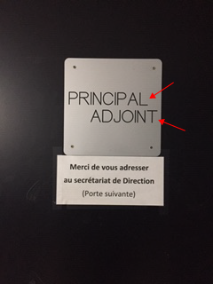

# Tool For Awesome Talks (TAT)
Un outil web permettant de réaliser facilement un support de présentation pour conférence

# Démo
http://sarahgarcin.com/tat-demo/

# Screenshot

# Manuel d’instructions pour le Tool For Awesome Talks

## Créer une nouvelle conférence
- Dupliquer le dossier “conference-TAT”, le renommer avec le nom de la conférence
- Supprimer tous les contenus dans le dossier “images”
- Remplir le dossier “images” avec les contenus de la conférence rangés dans l’ordre alphabétique

## Visualiser la conférence
- Ouvrir le Terminal
- Glisser le dossier de votre conférence sur l’icône du Terminal dans le Dock. Exemple: glisser le dossier “conference-TAT” sur l’icône Terminal. 
- Une fenêtre du terminal va s’ouvrir
- taper la commander “php -S localhost:8080”
- puis appuyer sur Enterré
- Ouvrir votre navigateur préféré
- Entrer localhost:8080 dans la barre d’url
- Votre conférence apparait (normalement) 

## Ajouter des médias
- Vous pouvez mettre des fichiers image (jpg, png ou gif) dans le dossier “images”, ces images s’afficheront en pleine page dans l’interface
- Vous pouvez mettre des fichiers son (wav ou mp3) dans le dossier “images”, un lecteur audio s’affichera
- Vous pouvez mettre des fichiers vidéo (mp4, webm ou ogg) dans le dossier “images”, la vidéo s’affichera en pleine page et il sera possible de la mettre en plein écran
- Vous pouvez mettre des fichiers PDF dans le dossier “images”, le pdf s’affichera dans le visualisateur PDF du navigateur

## Écrire des contenus texte / images / vidéos youtube et vimeo
- Ouvrir TextEdit
- Créer un nouveau fichier
- Le transformer en Plain Text (Texte plein): Format > Texte Plein 
- Écrire ses contenus comme suit (c’est du markdown la documentation est aussi là: https://docs.framasoft.org/fr/grav/markdown.html)

# Grand titre
## Moyen titre
### titre assez grand souligné
##### du gros texte
###### du texte plus petit que le texte courant

du texte courant  
du texte courant avec du **bold** et de l’*italique*  
pour marquer un saut de ligne il faut taper un double espace à la fin de la ligne  
- aussi on peut faire des listes
- comme ça  

### pour mettre un lien:
- le lien directement: http://pouet.net
- le lien avec un texte sur lequel cliquer: [Pouet](http://pouet.net) 

### mettre une image: 
  
Ici l’image porte-1-fleche.png est placé dans le dossier “images-slides” qui se trouvent dans le dossier “images”

### ajouter une vidéo youtube
<iframe src="https://www.youtube.com/embed/tgbNymZ7vqY" allowfullscreen width=640 height=360 ></iframe>   
mettre le lien embed de la video à la place de https://www.youtube.com/embed/tgbNymZ7vqY   
il est aussi possible de remplacer seulement l’identidiant de la vidéo dans l’url

### ajouter une vidéo viméo
<iframe src="https://player.vimeo.com/video/13416084" width="640" height="360" allowfullscreen></iframe>   
mettre le lien embed de la video à la place de https://player.vimeo.com/video/13416084
il est aussi possible de remplacer seulement l’identidiant de la vidéo dans l’url

## Ajouter une légende à une image
- Créer un fichier Plain Text
- Le nommer comme l’image avec l’extension .txt, exemple l’image s’appelle image.jpg, le fichier de légende devra s’appeler image.jpg.txt
- Écrire la légende en markdown dans le fichier

# Licence
[GPL](https://www.gnu.org/licenses/gpl-3.0.html)

 